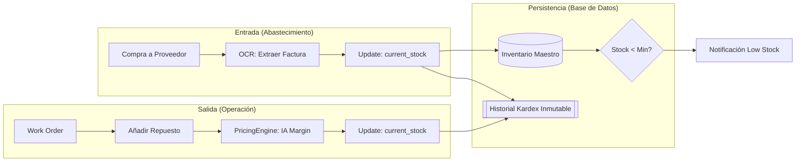
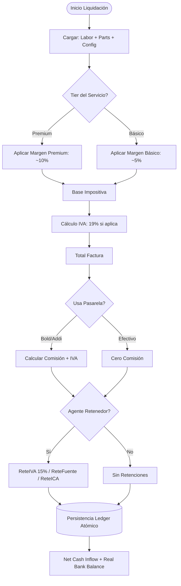

# Efisco ERP — Automotive Workshop SaaS

> **Ingeniería de software de alta precisión aplicada a la rentabilidad y automatización del sector automotriz.**

Efisco es una plataforma SaaS diseñada para transformar talleres mecánicos en centros operativos inteligentes. Integra un **Motor Financiero (Fiscal/Contable)** adaptado a la normativa colombiana 2026, un **Clasificador de Vehículos** para tarificación dinámica, **OCR con IA** para el control de egresos, y un **Panel de Administración Interno** para la gestión del ecosistema de talleres.


---

## Índice

- [Descripción General](#descripción-general)
- [Arquitectura](#arquitectura)
- [Stack Tecnológico](#stack-tecnológico)
- [Módulos del Sistema](#módulos-del-sistema)
- [Panel de Administración EFISCO](#panel-de-administración-efisco)
- [Motor Financiero](#motor-financiero)
- [Libro Auxiliar (Cash Flow Ledger)](#libro-auxiliar-cash-flow-ledger)
- [Variables de Entorno](#variables-de-entorno)

---

## Descripción General

Efisco no es un ERP genérico adaptado al sector automotriz — fue construido desde cero para resolver los problemas reales de los talleres colombianos:

- **Tarificación dinámica** basada en clasificador de vehículos por segmento (básico / premium)
- **Liquidación fiscal precisa** según normativa colombiana 2026: IVA, ReteFuente, ReteICA, ReteIVA, GMF 4×1000
- **Control de egresos con OCR** — extracción automática de datos de facturas de proveedores vía AWS Textract
- **Facturación electrónica** integrada con Dataico/DIAN (no bloqueante, guarda CUFE en base de datos)
- **Comunicación automatizada** con clientes vía WhatsApp Cloud API (Meta)
- **Multi-tenant** con aislamiento de datos por taller (RLS en Supabase)
- **Ventas a crédito** con plan de cuotas: INC_GROSS se registra en $0 al liquidar y el ingreso real entra vía pagos de cuotas
- **Panel de equilibrio interactivo** con gráfica SVG hover, proyección what-if con cálculo fiel de margen
- **IVA por categoría de repuesto** — tasas configurables por las 10 categorías de inventario
- **Presets PUC colombianos** — 3 regímenes fiscales que auto-rellenan los 21 códigos contables
- **Panel Admin EFISCO** — gestión interna de talleres, comisiones, referidos y suspensión de acceso

---

## Arquitectura

El sistema utiliza una arquitectura **multi-tenant** con aislamiento de datos a nivel de fila (RLS) y un núcleo de cálculo financiero inmutable.

### 1. Mapa de Componentes y Capas

```mermaid
graph LR
    classDef default stroke:#455a64,stroke-width:1px,fill:none;
    classDef highlight stroke:#0052cc,stroke-width:2px,fill:none;
    classDef engine stroke:#d9480f,stroke-width:1.5px,stroke-dasharray: 3 3,fill:none;
    classDef database stroke:#212529,stroke-width:2px,fill:none;
    classDef external stroke:#5f3dc4,stroke-width:1.5px,fill:none;
    classDef user stroke:#90a4ae,stroke-width:2px,stroke-dasharray: 5 5,fill:none;
    classDef admin stroke:#e53935,stroke-width:2px,fill:none;

    User((Taller)) --> FE[Frontend React 19]
    Admin((EFISCO Admin)) --> AdminFE["/admin Panel"]
    FE --> Auth[Middleware: JWT/RLS + Suspensión]
    AdminFE --> AdminAuth[requireAdmin: JWT Separado]

    subgraph Core [Backend Core - Express 5]
        Auth --> Ops[Módulo Operativo]
        Auth --> Inv[Módulo Logístico]
        Auth --> Fin[Módulo Financiero]
        AdminAuth --> AdminCtrl[Admin Controller]

        Ops --- VClass[Vehicle Classifier]
        Inv --- OCR[AWS Textract]
        Fin --- FEng[Financial Engine]
    end

    subgraph Data [Persistencia - Supabase]
        DB[(PostgreSQL Master)] --> Kardex[[Ledger Inmutable]]
        DB --> Admins[[efisco_admins]]
    end

    subgraph Externals [Servicios Externos]
        WA[WhatsApp API]
        Pay[Pasarelas Bold/Addi]
        DIAN[Dataico DIAN]
    end

    Ops & Inv & Fin & AdminCtrl ----> DB
    Ops --> WA
    Fin --> Pay
    Fin --> DIAN

    class User user;
    class Admin admin;
    class FE,Auth,Ops,Inv,Fin highlight;
    class AdminFE,AdminAuth,AdminCtrl admin;
    class VClass,OCR,FEng engine;
    class DB,Kardex,Admins database;
    class WA,Pay,DIAN external;
    class Admin,AdminFE,AdminAuth,AdminCtrl admin;
```



---

## Ciclo de Vida Operativo (End-to-End)

```mermaid
sequenceDiagram
    autonumber
    participant C as Cliente
    participant R as Recepción
    participant WA as WhatsApp (Meta)
    participant B as Bahía (Ops)
    participant I as Inventario
    participant F as Finanzas
    participant EXT as Externos (DIAN/Pay)
    participant DB as Persistencia (DB)

    C->>R: Ingreso (Reporte de Fallo)
    activate R
    R->>WA: Notificar al Cliente
    R->>B: Convertir a Orden de Trabajo
    activate B
    Note over B: El Classifier asigna Tier (Básico/Premium)
    deactivate R

    loop Durante el Servicio
        B->>I: Solicitar Repuesto
        activate I
        I->>DB: Validar Stock & TX
        DB-->>I: Confirmación
        I-->>B: Item Entregado
        deactivate I
        B->>B: Acumular Costos
    end

    B->>F: Finalizar y Liquidar
    activate F
    deactivate B

    rect rgb(0, 0, 0)
        Note over F, DB: Proceso de Cierre Contable (Fiscal 2026)
        F->>F: Calcular FinancialEngine
        F->>DB: Insertar Movimientos Ledger
        F->>EXT: Emitir Factura & Procesar Pago
    end

    F->>C: Vehículo Listo + Factura Digital
    deactivate F
```



---

## Lógica de Inventario y Kardex Inmutable
 
Trazabilidad total: cada movimiento físico genera un reflejo contable obligatorio en la base de datos.
 

 
---
 
## Motor Financiero (FinancialEngine.js)
 
### Matriz de Decisión de Liquidación
 

 
---

## Stack Tecnológico

| Capa | Tecnología | Rol |
|:---|:---|:---|
| UI | React 19 + Vite | SPA con routing client-side |
| Estilos | Tailwind CSS v4 | Design system utilitario |
| Estado | Zustand | `useFinancialStore`, `useBillingStore`, `useThemeStore`, `useAdminStore` |
| Backend | Express 5 + Node.js ESM | API REST con async/await nativo |
| Base de datos | Supabase (PostgreSQL) | Persistencia + RLS multi-tenant |
| OCR | AWS Textract | Extracción de facturas de proveedores |
| Comunicaciones | Meta WhatsApp Cloud API | Notificaciones automáticas |
| Facturación | Dataico | Emisión DIAN electrónica (no bloqueante) |
| Pasarelas | Bold (físico/online/QR) + Addi (crédito) | Procesamiento de pagos |
| Crypto | Node.js `crypto.scrypt` | Hash de contraseñas admin (sin bcrypt) |
| Admin JWT | `jsonwebtoken` con `ADMIN_JWT_SECRET` | Token separado del JWT de talleres |

---

## Decisiones Técnicas Clave

- **Multi-tenant con RLS** — Aislamiento por Row Level Security en PostgreSQL sin bases de datos independientes.
- **Ledger Inmutable** — Cada movimiento financiero es append-only. Trazabilidad contable completa y auditable.
- **Pipeline OCR asíncrono** — Procesamiento de facturas en segundo plano vía AWS Textract.
- **Tarificación dinámica por tier** — Clasificador de vehículos asigna el tier automáticamente.
- **Admin completamente aislado** — JWT separado (`ADMIN_JWT_SECRET`), Zustand store separado (`useAdminStore`), rutas `/admin/*` renderizadas antes del catch-all, localStorage keys distintas (`admin_token`/`admin_user` vs `token`/`user`).
- **Suspensión en dos capas** — `auth.controller.js` bloquea el login y `auth.middleware.js` invalida tokens ya emitidos, evitando que un token pre-suspensión siga funcionando.
- **Margen what-if fiel** — El cálculo de proyección usa costo variable absoluto por orden (`varCostPerOrder`), no margen porcentual fijo. Al subir precios, el margen % mejora automáticamente porque los costos de partes no suben.

---

## Módulos del Sistema

### Rutas del frontend

| Ruta | Módulo | Acceso |
|:---|:---|:---:|
| `/dashboard` | Dashboard | Todos |
| `/recepcion` | Recepción | Todos |
| `/bahia` | Bahías | Todos |
| `/inventario` | Inventario | Todos |
| `/proveedores` | Proveedores | Todos |
| `/ordenes` | Órdenes | Todos |
| `/referidos` | Referidos | Todos |
| `/soporte` | Soporte | Todos |
| `/config` | Configuración | Owner |
| `/finanzas` | Dashboard Financiero | Owner |
| `/equilibrio` | Panel de Equilibrio | Owner |
| `/cobros` | Panel de Cobros | Owner |
| `/flujo-caja` | Flujo de Caja | Owner |
| `/cliente/registro/:id` | Registro público del cliente | Público |
| `/admin` | Panel Admin EFISCO | Admin interno |
| `/admin/talleres` | Gestión de talleres | Admin interno |
| `/admin/pagos` | Liquidación de comisiones | Admin interno |
| `/admin/referidos` | Árbol de referidos | Admin interno |

---

### Recepción
Punto de ingreso de vehículos. Registra cliente, vehículo y síntomas reportados.

- **Clasificación de cliente**: Persona Natural | Empresa con sub-régimen (Simple / Ordinario / Gran Contribuyente)
- El tipo de cliente impacta directamente el cálculo de retenciones en la liquidación
- Notificación automática al cliente vía WhatsApp al crear la orden
- Score de riesgo crediticio visible antes de liquidar (`/api/clients/:cedula/risk-score`)

---

### Bahías (Órdenes de Trabajo)
Gestión del trabajo en taller: asignación de técnicos, registro de mano de obra y repuestos.

- Clasificador de vehículos determina el tier de servicio (Básico / Premium)
- Consumo de inventario con registro automático en el Kardex; cada ítem guarda `vat_percentage` (0%, 5% o 19%)
- Estado de la orden: `pending → ejecucion → ready_to_invoice → completed`
- **Modal de Liquidación** con pre-cálculo en vivo:
  - Simulación de comisiones Bold/Addi antes de confirmar
  - Retenciones si el cliente es agente retenedor
  - Modo crédito: selector de cuotas (2/3/4), fecha del primer pago
- Al liquidar se emite factura a Dataico/DIAN de forma no bloqueante; si tiene éxito guarda `cufe` e `invoice_pdf_url`

---

### Inventario
Control de existencias con trazabilidad completa.

- **Kardex inmutable**: cada movimiento genera una transacción en `inventory_transactions`
- **IVA por categoría**: al seleccionar la categoría del repuesto, el porcentaje de IVA se aplica automáticamente desde `workshop_config.category_vat_rates`
- **Alerta de stock mínimo por ítem** (`min_stock_vital`): badge en dashboard y color de fila en tabla
- `getItemHistory` ordena por `requested_at`

---

### Proveedores y Egresos
Gestión de proveedores y registro de compras con liquidación fiscal.

- **Perfil tributario del proveedor** (4 regímenes): Persona Natural · Régimen Simple · Régimen Ordinario · Gran Contribuyente
  - `simple`: no aplican retenciones
  - `ordinario` / `gran_contribuyente`: retenciones plenas según UVT (27 UVT ≈ $1.358.586)
- **Tasa de ReteICA por proveedor** (`reteica_rate_supplier`)
- **OCR de facturas**: AWS Textract extrae proveedor, ítems, valores
- **Método de pago**: `banco` → GMF 4×1000 | `tarjeta` → costo de transacción | `efectivo` → sin costos
- **Código PUC por proveedor** (`puc_account_expense`): usado en asiento del ledger si está definido

---

### Panel de Equilibrio (`/equilibrio`)
Análisis de punto de equilibrio, capacidad operativa y proyección de escenarios.

```
Costos Fijos = arriendo + servicios públicos + nómina (fixed_costs_salaries)
Margen de Contribución = ingresos netos / ingresos brutos
Punto de Equilibrio = costos fijos / margen de contribución
```

**Gráfica SVG interactiva:**
- Hover con crosshair vertical que sigue el cursor
- Tooltip en tiempo real mostrando ingresos, costo total y ganancia/pérdida en ese punto
- Eje X con cantidad de órdenes equivalente a cada nivel de ingreso
- Zonas de pérdida (roja) y ganancia (verde) con relleno semitransparente
- Puntos "PE" (ámbar) y "Hoy" (azul) siempre visibles

**Proyección What-if (cálculo fiel):**
- Los costos variables son **absolutos por orden** (precio de partes), no porcentuales
- Al subir precios, el margen % mejora automáticamente: `wiMarginPct = (wiRevenue − varCosts) / wiRevenue`
- El nuevo PE se recalcula con el margen proyectado: `wiPE = wiFixedCosts / wiMarginPct`
- Panel de resultado muestra comparativa lado a lado: órdenes actuales vs proyectadas, costos fijos actuales vs proyectados
- El hint de órdenes necesarias usa contribución neta por orden: `ceil(wiGap / (wiTicket − varCostPerOrder))`

---

### Panel de Cobros (`/cobros`)
Gestión de cuentas por cobrar — ventas a crédito e installments.

- Lista de cuotas pendientes con fecha de vencimiento
- Registro de pago: genera asiento `INC_GROSS` con PUC `puc_income_code || '4135'`
- Notificación al cliente vía WhatsApp al registrar cada abono

---

### Flujo de Caja (`/flujo-caja`)
Libro mayor de todos los movimientos financieros.

- Filtro por rango de fechas y tipo de impacto (CREDIT / DEBIT / Todos)
- Agrupación por día con subtotales diarios
- Balance acumulado por movimiento (`running_balance`)
- Descarga CSV vía `/api/finance/report/ledger`

---

### Referidos
Sistema de referidos entre talleres con descuentos acumulados.

| Suscripciones referidas | Descuento aplicado |
|:---:|:---|
| 1 | 33% sobre cuota mensual |
| 2 | 66% sobre cuota mensual |
| 3+ | 100% (mes gratis) |
| Platino (>5) | 15% comisión directa (aplicado por EFISCO) |

---

### Configuración del Taller (`/config`)
Panel de administración fiscal y operativa. Cinco pestañas:

**1. Datos del Taller** — Nombre, dirección, horarios, costos fijos (arriendo + servicios)

**2. Mi Equipo & Roles** — Alta de empleados, esquemas de compensación (fijo / comisión / híbrido)

**3. Catálogo de Servicios** — CRUD con márgenes básico/premium por tipo de vehículo

**4. Pasarelas y Finanzas**

*Régimen Fiscal* (4 opciones):
| Opción | IVA | Reg. Simple | Agente Retenedor |
|:---|:---:|:---:|:---:|
| No Responsable de IVA | ✗ | ✗ | ✗ |
| Régimen Simple (SIMPLE) | ✓ | ✓ | ✗ |
| Régimen Ordinario | ✓ | ✗ | ✓ |
| Gran Contribuyente | ✓ | ✗ | ✓ |

*Tasas configurables*: IVA (19%), ReteICA (‰), ReteFuente declarantes/no declarantes, ReteIVA (15%)

*Pasarelas*: Bold físico (2.99%), Bold online (3.49%), Addi (10.5%), GMF 4×1000

**5. Módulo del Contador**

*Identidad Legal*: NIT, Razón Social, Prefijo, Clave técnica DIAN

*Presets PUC* — 3 botones que auto-rellenan los 21 códigos según régimen:
- **Régimen Ordinario** (estándar DIAN)
- **Régimen Simple** (subcuentas simplificadas)
- **Gran Contribuyente** (subcuentas retención en la fuente)

*Plan Único de Cuentas — 21 códigos en 5 bloques*:

| Bloque | Códigos | Defaults |
|:---|:---|:---|
| Ingresos & Ventas | `puc_income_code`, `puc_parts_income_code`, `puc_gateway_fee_code`, `puc_gateway_vat_code` | `4135`, `4135`, `5290`, `2408` |
| IVA | `puc_iva_generated_code`, `puc_iva_generated_5_code`, `puc_iva_deductible_code`, `puc_devolucion_iva_code` | `240805`, `240810`, `240820`, `135520` |
| Retenciones por Pagar | `puc_retefuente_code`, `puc_retefuente_compras_decl_code`, `puc_retefuente_compras_nodecl_code`, `puc_retefuente_servicios_code`, `puc_reteiva_code`, `puc_reteica_code` | `2365`, `236540`, `236540`, `236525`, `2367`, `2368` |
| Retenciones a Favor | `puc_anticipo_retefuente_code`, `puc_anticipo_reteica_code`, `puc_pasarela_retencion_code` | `135515`, `135518`, `135595` |
| Control Financiero | `puc_cxc_clientes_code`, `puc_cxp_proveedores_code`, `puc_otros_ingresos_code`, `puc_gastos_financieros_code` | `130505`, `220505`, `4210`, `5305` |

*IVA por Categoría de Repuesto* — 10 categorías con tasa individual configurada que se aplica automáticamente al seleccionar categoría en Inventario.

*Exportación contable*: CSV de facturas, compras a proveedores, CxC, CxP, libro fiscal e inventario valorizado.

*Integración Dataico*: API key, authtoken, environment (test/prod), rango de numeración, botón de prueba de conexión.

---

## Panel de Administración EFISCO

Panel interno en `/admin` con autenticación completamente separada de los talleres.

### Autenticación admin
- JWT firmado con `ADMIN_JWT_SECRET` (distinto al JWT de Supabase de los talleres)
- Hash de contraseñas con `crypto.scrypt` + sal de 16 bytes (sin dependencias externas)
- Bootstrap: `POST /api/admin/bootstrap` — solo funciona si `efisco_admins` está vacío
- Token almacenado en `admin_token` (localStorage), distinto de `token` de talleres

### Módulos del panel admin

**Dashboard** — 4 KPIs: talleres activos/totales, órdenes del mes, ingresos brutos del mes, pagos de comisiones pendientes.

**Talleres** — Lista paginada y buscable de todos los talleres:
- Ver configuración completa (grid de 9 campos)
- Crear taller nuevo (crea usuario Supabase Auth + `workshop_config` en transacción)
- **Suspender / Reactivar** — `PATCH /api/admin/workshops/:id/toggle` actualiza `is_active` en `workshop_config`
  - La suspensión bloquea el login (`auth.controller.js`) Y los requests en curso (`auth.middleware.js`)
  - El taller suspendido ve una pantalla de "Cuenta suspendida" con canales de contacto

**Pagos** — Gestión de solicitudes de pago de comisiones por referidos:
- Filtros: pendiente / en proceso / pagado
- KPIs por estado
- `PATCH /api/admin/payouts/:id/mark-paid`

**Referidos** — Árbol jerárquico recursivo de referidos con colapso/expansión:
- Colores por nivel: gris (0), azul (1-2), púrpura (Platino: 3+)
- KPIs: total nodos, referidores activos, Platinos, comisiones totales

### Rutas API admin

| Método | Ruta | Auth | Descripción |
|:---|:---|:---:|:---|
| POST | `/api/admin/bootstrap` | Pública | Crea primer admin (solo si tabla vacía) |
| POST | `/api/admin/login` | Pública | Login admin con email/password |
| GET | `/api/admin/stats` | Admin | KPIs del dashboard |
| GET | `/api/admin/workshops` | Admin | Lista talleres (con emails de Supabase Auth) |
| GET | `/api/admin/workshops/:id` | Admin | Detalle de taller |
| POST | `/api/admin/workshops` | Admin | Crear taller nuevo |
| PATCH | `/api/admin/workshops/:id/toggle` | Admin | Suspender / reactivar |
| GET | `/api/admin/payouts` | Admin | Lista de solicitudes de pago |
| PATCH | `/api/admin/payouts/:id/mark-paid` | Admin | Marcar pago como completado |
| GET | `/api/admin/referrals` | Admin | Árbol de referidos |

---

## Motor Financiero

`backend/utils/financialEngine.js` — núcleo de cálculo inmutable. Constantes 2026: UVT = $50.318, umbral retenciones = 27 UVT ≈ $1.358.586.

### 1. Liquidación de servicios (`liquidateClientInvoice`)

```
Base Impositiva = Mano de Obra × (1 + margen%) + Repuestos (con margen)
IVA             = Base × vat_percentage            (si is_responsable_iva)
Total Factura   = Base + IVA

Si clientIsRetainer:
  ReteFuente = Base × retefuente_rate_declarante
  ReteICA    = Base × (reteica_rate / 1000)
  ReteIVA    = IVA  × reteiva_rate

Pasarela Bold presencial:
  tarjeta_nacional     → 2.99% + $300
  tarjeta_internacional → 3.99% + $300
  qr_billetera         → 1.50%

Pasarela Bold online:
  tarjeta_nacional     → 3.49% + $900
  tarjeta_internacional → 4.49% + $900
  qr_billetera         → 1.50%

Pasarela Addi: gateway_addi_rate / 100
IVA sobre comisión = Comisión × 0.19

Net Cash Inflow = Total − ReteFuente − ReteICA − ReteIVA − Comisión − IVA comisión
```

**Venta a crédito**: `INC_GROSS.net_amount = 0` al liquidar; ingresos reales entran vía `payInstallment`.

---

### 2. Liquidación de compras (`liquidateSupplierPurchase`)

```
Base          = total_gross_cost / (1 + 0.19)
IVA de Compra = total_gross_cost − Base

Retenciones (base ≥ 27 UVT AND proveedor ≠ 'simple'):
  ReteFuente: declarante → Base × supplier_retefuente_rate
              no declarante → Base × supplier_retefuente_rate × 1.4
  ReteICA:   Base × (reteica_rate_supplier ?? config.supplier_reteica_rate / 1000)
  ReteIVA:   IVA × 0.15

GMF (payment_method='banco' AND apply_4x1000=true):
  GMF = total_gross_cost × 0.004

Net Outflow = total_gross_cost − ReteFuente − ReteICA − GMF
```

---

### 3. Salud financiera global (`calculateGlobalHealth`)

```
totalInflows  = Σ INC_GROSS (CREDIT) + NON_OP_INC + VAT_REFUND
totalOutflows = Σ SUP_PAY + GW_FEE + GW_VAT + TAX_GMF + CARD_FEE (DEBIT)

bankBalance     = totalInflows − totalOutflows
ivaLiability    = Σ TAX_IVA − Σ RET_IVA − Σ VAT_REFUND
realBankBalance = bankBalance − ivaLiability
```

---

## Libro Auxiliar (Cash Flow Ledger)

### Tipos de movimiento

| Tipo | Impacto | Descripción |
|:---|:---:|:---|
| `INC_GROSS` | CREDIT | Ingreso por servicio (net_amount = 0 en crédito) |
| `TAX_IVA` | CREDIT | IVA generado en la venta |
| `RET_FUENT` | DEBIT | ReteFuente practicada por el cliente |
| `RET_ICA` | DEBIT | ReteICA practicada por el cliente |
| `RET_IVA` | DEBIT | ReteIVA practicada por el cliente |
| `GW_FEE` | DEBIT | Comisión de pasarela (Bold / Addi) |
| `GW_VAT` | DEBIT | IVA sobre comisión de pasarela |
| `SUP_PAY` | DEBIT | Pago a proveedor |
| `TAX_GMF` | DEBIT | GMF 4×1000 en pagos bancarios |
| `CARD_FEE` | DEBIT | Costo de transacción con tarjeta |
| `NON_OP_INC` | CREDIT | Ingreso no operacional (manual) |
| `VAT_REFUND` | CREDIT | Devolución de IVA (`puc_code = '135520'`) |
| `MAN_INC` | CREDIT | Ingreso manual registrado por el usuario |
| `MAN_EGR` | DEBIT | Egreso manual registrado por el usuario |
| `REFERRAL` | CREDIT | Ingreso por comisión de referido |

---

## Variables de Entorno

`backend/.env`:

```env
# Supabase
SUPABASE_URL=https://<project>.supabase.co
SUPABASE_SERVICE_ROLE_KEY=<service-role-key>

# JWT talleres (Supabase)
JWT_SECRET=<secret>

# JWT admin interno EFISCO (separado)
ADMIN_JWT_SECRET=<secret-admin>

# AWS Textract (OCR)
AWS_ACCESS_KEY_ID=<key>
AWS_SECRET_ACCESS_KEY=<secret>
AWS_REGION=us-east-1

# WhatsApp Meta Cloud API
WHATSAPP_TOKEN=<bearer-token>
WHATSAPP_PHONE_NUMBER_ID=<phone-id>

# Dataico (Facturación DIAN)
DATAICO_AUTH_TOKEN=<auth-token>
DATAICO_BASE_URL=https://app.dataico.com/api/2
```

---

## 📬 Contacto
efiscosas@gmail.com

Desarrollado y mantenido por un solo desarrollador.

---

**Efisco ERP** — *Impulsando la ingeniería automotriz a través de software de alto rendimiento.*
