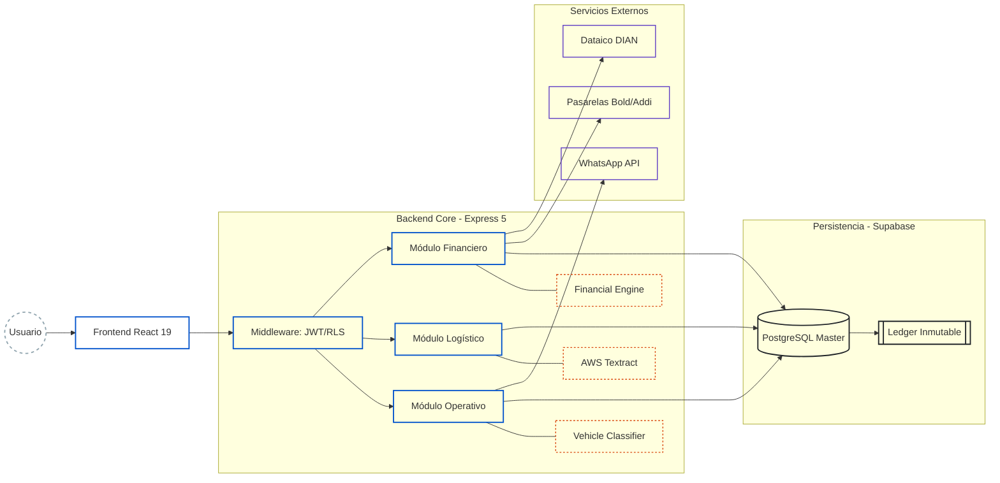
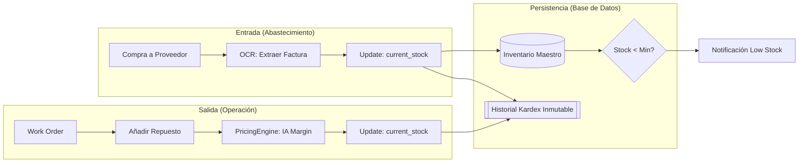

# Efisco ERP — Automotive Workshop SaaS

> **Ingeniería de software de alta precisión aplicada a la rentabilidad y automatización del sector automotriz.**
 
Efisco es una plataforma SaaS diseñada para transformar talleres mecánicos en centros operativos inteligentes. A diferencia de un ERP genérico, Efisco integra un **Motor Financiero (Fiscal/Contable)** adaptado a la normativa colombiana de 2026, un **Clasificador de Vehículos** para tarificación dinámica y **OCR con IA** para el control de egresos.


> 🌐 [Read in English](./README.md)

---

## Índice

- [Descripción General](#descripción-general)
- [Arquitectura](#arquitectura)
- [Stack Tecnológico](#stack-tecnológico)
- [Módulos del Sistema](#módulos-del-sistema)
- [Motor Financiero](#motor-financiero)
- [Libro Auxiliar (Cash Flow Ledger)](#libro-auxiliar-cash-flow-ledger)
- [Variables de Entorno](#variables-de-entorno)

---

## Descripción General

Efisco no es un ERP genérico adaptado al sector automotriz — fue construido desde cero para resolver los problemas reales de los talleres colombianos:

- **Tarificación dinámica** basada en un clasificador de vehículos por segmento (básico / premium)
- **Liquidación fiscal precisa** según normativa colombiana 2026: IVA, ReteFuente, ReteICA, ReteIVA, GMF 4×1000
- **Control de egresos con OCR** — extracción automática de datos de facturas de proveedores vía AWS Textract
- **Facturación electrónica** integrada con Dataico/DIAN (no bloqueante, guarda CUFE en base de datos)
- **Comunicación automatizada** con clientes vía WhatsApp Cloud API (Meta)
- **Multi-tenant** con aislamiento de datos por taller (RLS en Supabase)
- **Ventas a crédito** con plan de cuotas: INC_GROSS se registra en $0 al liquidar y el ingreso real entra vía pagos de cuotas
- **Panel de punto de equilibrio** con costos fijos desagregados (arriendo + servicios + nómina) y análisis de capacidad operativa

---
 
## Arquitectura
 
El sistema utiliza una arquitectura **multi-tenant** con aislamiento de datos a nivel de fila (RLS) y un núcleo de cálculo financiero inmutable.
 
### 1. Mapa de Componentes y Capas
 

 
---
 
## Ciclo de Vida Operativo (End-to-End)

```mermaid
sequenceDiagram
    autonumber
    participant C as Cliente
    participant R as Recepción
    participant WA as WhatsApp (Meta)
    participant B as Bahía (Ops)
    participant I as Inventario
    participant F as Finanzas
    participant EXT as Externos (DIAN/Pay)
    participant DB as Persistencia (DB)

    C->>R: Ingreso (Reporte de Fallo)
    activate R
    R->>WA: Notificar al Cliente
    R->>B: Convertir a Orden de Trabajo
    activate B
    Note over B: El Classifier asigna Tier (Básico/Premium)
    deactivate R

    loop Durante el Servicio
        B->>I: Solicitar Repuesto
        activate I
        I->>DB: Validar Stock & TX
        DB-->>I: Confirmación
        I-->>B: Item Entregado
        deactivate I
        B->>B: Acumular Costos
    end

    B->>F: Finalizar y Liquidar
    activate F
    deactivate B

    rect rgb(0, 0, 0)
        Note over F, DB: Proceso de Cierre Contable (Fiscal 2026)
        F->>F: Calcular FinancialEngine
        F->>DB: Insertar Movimientos Ledger
        F->>EXT: Emitir Factura & Procesar Pago
    end

    F->>C: Vehículo Listo + Factura Digital
    deactivate F
```
 
Flujo de ejecución completo con gestión de estados y activaciones síncronas.
 

 
---
 
## Lógica de Inventario y Kardex Inmutable
 
Trazabilidad total: cada movimiento físico genera un reflejo contable obligatorio en la base de datos.
 

 
---
 
## Motor Financiero (FinancialEngine.js)
 
### Matriz de Decisión de Liquidación
 

 
---

## Stack Tecnológico

| Capa | Tecnología | Rol |
|:---|:---|:---|
| UI | React 19 + Vite | SPA con routing client-side |
| Estilos | Tailwind CSS v4 | Design system utilitario |
| Estado | Zustand | Estado global ligero (`useFinancialStore`, `useBillingStore`, `useThemeStore`) |
| Backend | Express 5 + Node.js ESM | API REST con async/await nativo |
| Base de datos | Supabase (PostgreSQL) | Persistencia + RLS multi-tenant |
| OCR | AWS Textract | Extracción de facturas de proveedores |
| Comunicaciones | Meta WhatsApp Cloud API | Notificaciones automáticas |
| Facturación | Dataico | Emisión DIAN electrónica (no bloqueante) |
| Pasarelas | Bold (físico/online/QR) + Addi (crédito) | Procesamiento de pagos |

---
 
## 🔑 Decisiones Técnicas Clave
 
- **Multi-tenant con RLS** — El aislamiento por Row Level Security en PostgreSQL garantiza separación total de datos entre talleres sin necesidad de bases de datos independientes.
- **Ledger Inmutable** — Cada movimiento financiero es append-only. Ningún registro se actualiza ni elimina, garantizando trazabilidad contable completa y auditable.
- **Pipeline OCR asíncrono** — El procesamiento de facturas de proveedores corre en segundo plano vía AWS Textract, manteniendo la interfaz responsive en todo momento.
- **Tarificación dinámica por tier** — El Clasificador de Vehículos asigna automáticamente el tier de servicio, permitiendo control de márgenes sin configuración manual por servicio.
---

## Módulos del Sistema

### Rutas del frontend

| Ruta | Módulo | Acceso |
|:---|:---|:---:|
| `/dashboard` | Dashboard | Todos |
| `/recepcion` | Recepción | Todos |
| `/bahia` | Bahías | Todos |
| `/inventario` | Inventario | Todos |
| `/proveedores` | Proveedores | Todos |
| `/ordenes` | Órdenes | Todos |
| `/referidos` | Referidos | Todos |
| `/soporte` | Soporte | Todos |
| `/config` | Configuración | Owner |
| `/finanzas` | Dashboard Financiero | Owner |
| `/equilibrio` | Panel de Equilibrio | Owner |
| `/cobros` | Panel de Cobros | Owner |
| `/flujo-caja` | Flujo de Caja | Owner |
| `/cliente/registro/:id` | Registro público del cliente | Público |

---

### Recepción
Punto de ingreso de vehículos. Registra cliente, vehículo y síntomas reportados.

- **Clasificación de cliente en 2 niveles**: Persona Natural | Empresa (con sub-régimen: Simple / Ordinario / Gran Contribuyente)
- El tipo de cliente impacta directamente el cálculo de retenciones en la liquidación de la orden
- Notificación automática al cliente vía WhatsApp al crear la orden
- Score de riesgo crediticio visible antes de liquidar (`/api/clients/:cedula/risk-score`)

---

### Bahías (Órdenes de Trabajo)
Gestión del trabajo en taller: asignación de técnicos, registro de mano de obra y repuestos.

- Clasificador de vehículos determina el tier de servicio (Básico / Premium) que afecta los márgenes aplicados
- Consumo de inventario con registro automático en el Kardex; cada ítem guarda su `vat_percentage` (0%, 5% o 19%)
- Estado de la orden: `pending → ejecucion → ready_to_invoice → completed`
- **Modal de Liquidación** con pre-cálculo en vivo:
  - Simulación de comisiones Bold/Addi antes de confirmar
  - Retenciones si el cliente es agente retenedor
  - Modo crédito: selector de cuotas (2/3/4), fecha del primer pago
- Al liquidar se emite factura a Dataico/DIAN de forma no bloqueante; si tiene éxito guarda `cufe` e `invoice_pdf_url` en `work_orders`

---

### Inventario
Control de existencias con trazabilidad completa.

- **Kardex inmutable**: cada movimiento (compra, consumo, ajuste) genera una transacción en `inventory_transactions`
- Integración con módulo de Proveedores: al registrar una compra se actualiza el stock automáticamente si `sync_stock = true`
- **Alerta de stock mínimo por ítem** (`min_stock_vital`): el badge del dashboard y el color de fila en la tabla usan el umbral individual de cada producto. Si `min_stock_vital` no está configurado en el ítem, aplica un fallback de 5 unidades
- `getItemHistory` ordena por `requested_at` (no por `created_at`)
- Los ítems agregados a una orden de trabajo almacenan `vat_percentage` en `service_inventory_items`

---

### Proveedores y Egresos
Gestión de proveedores y registro de compras con liquidación fiscal de egresos.

- **Perfil tributario del proveedor** (4 regímenes): Persona Natural · Régimen Simple · Régimen Ordinario · Gran Contribuyente
  - Régimen `simple`: **no aplican retenciones** (ni ReteFuente, ni ReteICA, ni ReteIVA)
  - Régimen `ordinario` / `gran_contribuyente`: retenciones plenas según UVT (umbral: 27 UVT ≈ $1.358.586)
  - `is_declarante` del proveedor determina la tasa de ReteFuente (declarante = `supplier_retefuente_rate`, no declarante = tasa × 1.4)
- **Tasa de ReteICA por proveedor** (`reteica_rate_supplier` en la tabla `providers`): si está definida se usa en lugar de la tasa general del taller
- **OCR de facturas**: sube imagen → AWS Textract extrae proveedor, ítems, valores
- **Método de pago del taller**:
  - `banco` — activa opción de GMF 4×1000 → genera asiento `TAX_GMF`
  - `tarjeta` — campo para registrar costo de la transacción → genera asiento `CARD_FEE`
  - `efectivo` — sin costos financieros adicionales
- **Código PUC por proveedor** (`puc_account_expense`): si está definido en el proveedor, se usa en el asiento del ledger en lugar del código global (`puc_inventory_purchase_code` o fallback `'1435'`)
- Comprobante de pago generado en pantalla con desglose completo

---

### Finanzas — Dashboard Financiero (`/finanzas`)
Vista consolidada de rentabilidad operativa.

- Margen neto, ingresos brutos, costos fijos (arriendo + servicios públicos + **nómina**)
- Alertas de stock usando `min_stock_vital` por ítem
- `calculateGlobalHealth` incluye `GW_FEE`, `GW_VAT`, `TAX_GMF` y `CARD_FEE` como egresos reales (antes solo `SUP_PAY`)

---

### Panel de Equilibrio (`/equilibrio`)
Análisis de punto de equilibrio y capacidad operativa del taller.

```
Costos Fijos = arriendo + servicios públicos + nómina (fixed_costs_salaries)
Margen de Contribución = ingresos netos / ingresos brutos
Punto de Equilibrio = costos fijos / margen de contribución
```

- Si no hay ingresos en el período, `margen_contribucion` y `punto_equilibrio` retornan `null` (sin mostrar valor ficticio)
- Métricas adicionales: horas disponibles/trabajadas, tarifa-hora, ingresos potenciales (`ip`)
- Requiere la columna `workshop_config.fixed_costs_salaries` (ver migraciones)

---

### Panel de Cobros (`/cobros`)
Gestión de cuentas por cobrar — ventas a crédito e installments.

- Lista de cuotas pendientes con fecha de vencimiento
- Registro de pago de cuota: llama a `POST /api/billing/installment/:id/pay`
  - Genera asiento `INC_GROSS` con `net_amount = inst.amount` y PUC `puc_income_code || '4135'`
  - Notificación al cliente vía WhatsApp al registrar cada abono

---

### Flujo de Caja (`/flujo-caja`)
Libro mayor de todos los movimientos financieros del taller.

- Filtro por rango de fechas (por defecto: mes actual)
- Filtro por tipo de impacto (`CREDIT` / `DEBIT` / Todos)
- Agrupación por día con subtotales diarios de créditos y débitos
- Balance acumulado por movimiento (`running_balance`)
- Etiquetas completas para todos los tipos del ledger (ver tabla en sección [Libro Auxiliar](#libro-auxiliar-cash-flow-ledger))
- Descarga CSV vía `/api/finance/report/ledger`

---

### Referidos
Sistema de referidos entre talleres con descuentos acumulados por suscripciones activas referidas.

| Suscripciones referidas | Descuento aplicado |
|:---:|:---|
| 1 | 33% sobre cuota mensual |
| 2 | 66% sobre cuota mensual |
| 3+ | 100% (mes gratis) |
| Platino (>5) | 15% comisión directa (aplicado por EFISCO) |

---

### Configuración del Taller (`/config`)
Panel de administración fiscal y operativa del taller. Cinco pestañas:

**1. Datos del Taller**
- Nombre, dirección, barrio
- Horarios (apertura, cierre, almuerzo, fines de semana, festivos)
- Costos fijos: arriendo y servicios públicos

**2. Mi Equipo & Roles**
- Alta de empleados (mecánico / admin)
- Esquemas de compensación: salario fijo, comisión variable, híbrido
- Creación de credenciales de acceso al sistema

**3. Catálogo de Servicios**
- CRUD de servicios con márgenes básico/premium por tipo de vehículo

**4. Pasarelas y Finanzas**

*Régimen Fiscal* (4 opciones):
| Opción | IVA | Reg. Simple | Agente Retenedor |
|:---|:---:|:---:|:---:|
| No Responsable de IVA | ✗ | ✗ | ✗ |
| Régimen Simple (SIMPLE) | ✓ | ✓ | ✗ |
| Régimen Ordinario | ✓ | ✗ | ✓ |
| Gran Contribuyente | ✓ | ✗ | ✓ |

*Tasas de retención configurables*:
- IVA (default 19%)
- ReteICA (por mil, default 0.966‰)
- ReteFuente compras declarantes (default 2.5%)
- ReteFuente compras no declarantes (default 3.5%)
- ReteIVA (default 15%)

*Pasarelas*:
- Bold físico (default 2.99%)
- Bold online (default 3.49%)
- Addi (default 10.5%)
- GMF 4×1000 activable por pago

**5. Módulo del Contador**

*Identidad Legal*: NIT, Razón Social, Prefijo de factura, Clave técnica DIAN

*Plan Único de Cuentas (PUC) — 21 códigos en 5 bloques*:

| Bloque | Códigos | Defaults |
|:---|:---|:---|
| Ingresos & Ventas | `puc_income_code`, `puc_parts_income_code`, `puc_gateway_fee_code`, `puc_gateway_vat_code` | `4135`, `4135`, `5290`, `2408` |
| IVA | `puc_iva_generated_code`, `puc_iva_generated_5_code`, `puc_iva_deductible_code`, `puc_devolucion_iva_code` | `240805`, `240810`, `240820`, `135520` |
| Retenciones por Pagar | `puc_retefuente_code`, `puc_retefuente_compras_decl_code`, `puc_retefuente_compras_nodecl_code`, `puc_retefuente_servicios_code`, `puc_reteiva_code`, `puc_reteica_code` | `2365`, `236540`, `236540`, `236525`, `2367`, `2368` |
| Retenciones a Favor | `puc_anticipo_retefuente_code`, `puc_anticipo_reteica_code`, `puc_pasarela_retencion_code` | `135515`, `135518`, `135595` |
| Control Financiero | `puc_cxc_clientes_code`, `puc_cxp_proveedores_code`, `puc_otros_ingresos_code`, `puc_gastos_financieros_code` | `130505`, `220505`, `4210`, `5305` |

*Exportación contable*: CSV de facturas, compras a proveedores, CxC, CxP, libro fiscal e inventario valorizado.

*Integración Dataico*: configuración de API key, authtoken, environment (test/prod) y rango de numeración con botón de prueba de conexión.

---

## Motor Financiero

`backend/utils/financialEngine.js` — núcleo de cálculo inmutable. Constantes 2026: UVT = $50.318, umbral retenciones = 27 UVT ≈ $1.358.586.

### 1. Liquidación de servicios (`liquidateClientInvoice`)

```
Base Impositiva = Mano de Obra × (1 + margen%) + Repuestos (con margen)
IVA             = Base × vat_percentage            (si is_responsable_iva)
Total Factura   = Base + IVA

Si el cliente es agente retenedor (clientIsRetainer):
  ReteFuente = Base × retefuente_rate_declarante   (del config del taller)
  ReteICA    = Base × (reteica_rate / 1000)        (por mil, no por ciento)
  ReteIVA    = IVA  × reteiva_rate

Pasarela Bold (presencial):
  tarjeta_nacional     → 2.99% + $300 fijo
  tarjeta_internacional → 3.99% + $300 fijo
  qr_billetera         → 1.50% (sin fijo)

Pasarela Bold (online):
  tarjeta_nacional     → 3.49% + $900 fijo
  tarjeta_internacional → 4.49% + $900 fijo
  qr_billetera         → 1.50%

Pasarela Addi: gateway_addi_rate / 100

IVA sobre comisión = Comisión × 0.19

Net Cash Inflow = Total − ReteFuente − ReteICA − ReteIVA − Comisión − IVA comisión
```

**Venta a crédito** (`payment_mode = 'credito'` y `num_installments > 1`):
- Al liquidar: `INC_GROSS.net_amount = 0`, PUC usa `puc_cxc_clientes_code || '1305'` (Cuentas por Cobrar)
- Los ingresos reales entran al ledger vía `payInstallment` con `INC_GROSS.net_amount = cuota.amount` y PUC `puc_income_code || '4135'`

---

### 2. Liquidación de compras (`liquidateSupplierPurchase`)

```
Base          = total_gross_cost / (1 + 0.19)
IVA de Compra = total_gross_cost − Base

Retenciones (solo si base ≥ 27 UVT Y régimen del proveedor ≠ 'simple'):
  ReteFuente:
    is_declarante = true  → Base × supplier_retefuente_rate       (config)
    is_declarante = false → Base × supplier_retefuente_rate × 1.4 (aprox. tasa no declarante)
  ReteICA:
    si proveedor.reteica_rate_supplier está definido:
      Base × (proveedor.reteica_rate_supplier / 1000)
    si no:
      Base × (config.supplier_reteica_rate / 1000 || 0.00966)
  ReteIVA = IVA × 0.15

GMF 4×1000 (solo payment_method='banco' y apply_4x1000=true):
  GMF = total_gross_cost × 0.004

Net Outflow = total_gross_cost − ReteFuente − ReteICA − GMF
```

**Régimen Simple del proveedor**: omite completamente ReteFuente, ReteICA y ReteIVA.

---

### 3. Salud financiera global (`calculateGlobalHealth`)

```
totalInflows  = Σ net_amount de INC_GROSS (CREDIT)
              + Σ amount de NON_OP_INC (CREDIT)
              + Σ amount de VAT_REFUND (CREDIT)

totalOutflows = Σ net_amount de SUP_PAY + GW_FEE + GW_VAT + TAX_GMF + CARD_FEE (DEBIT)

bankBalance     = totalInflows − totalOutflows
ivaLiability    = Σ TAX_IVA (CREDIT) − Σ RET_IVA (DEBIT) − Σ VAT_REFUND
realBankBalance = bankBalance − ivaLiability
```

---

## Libro Auxiliar (Cash Flow Ledger)

`cash_flow_ledger` — registro doble de todos los movimientos del taller.

### Campos principales

| Campo | Descripción |
|:---|:---|
| `type` | Tipo de movimiento (ver tabla abajo) |
| `impact` | `CREDIT` (entrada) o `DEBIT` (salida) |
| `amount` | Valor bruto del movimiento (total factura) |
| `gross_amount` | Base antes de IVA |
| `net_amount` | Dinero efectivamente recibido o pagado |
| `puc_code` | Código PUC para exportación contable |
| `running_balance` | Saldo acumulado en el período |

### Tipos de movimiento

| Tipo | Impacto | Descripción |
|:---|:---:|:---|
| `INC_GROSS` | CREDIT | Ingreso por servicio (net_amount = 0 en ventas a crédito) |
| `TAX_IVA` | CREDIT | IVA generado en la venta |
| `RET_FUENT` | DEBIT | ReteFuente practicada por el cliente |
| `RET_ICA` | DEBIT | ReteICA practicada por el cliente |
| `RET_IVA` | DEBIT | ReteIVA practicada por el cliente |
| `GW_FEE` | DEBIT | Comisión de pasarela (Bold / Addi) |
| `GW_VAT` | DEBIT | IVA sobre comisión de pasarela |
| `SUP_PAY` | DEBIT | Pago a proveedor (compra de repuestos) |
| `TAX_GMF` | DEBIT | GMF 4×1000 en pagos bancarios |
| `CARD_FEE` | DEBIT | Costo de transacción con tarjeta |
| `NON_OP_INC` | CREDIT | Ingreso no operacional (manual) |
| `VAT_REFUND` | CREDIT | Devolución de IVA (`puc_code = '135520'`) |
| `MAN_INC` | CREDIT | Ingreso manual registrado por el usuario |
| `MAN_EGR` | DEBIT | Egreso manual registrado por el usuario |
| `REFERRAL` | CREDIT | Ingreso por comisión de referido |

---

## Variables de Entorno

`backend/.env.example`:

```env
# Supabase
SUPABASE_URL=https://<project>.supabase.co
SUPABASE_SERVICE_ROLE_KEY=<service-role-key>

# JWT
JWT_SECRET=<secret-aleatorio-seguro>

# AWS Textract (OCR)
AWS_ACCESS_KEY_ID=<key>
AWS_SECRET_ACCESS_KEY=<secret>
AWS_REGION=us-east-1

# WhatsApp Meta Cloud API
WHATSAPP_TOKEN=<bearer-token>
WHATSAPP_PHONE_NUMBER_ID=<phone-id>

# Dataico (Facturación DIAN)
DATAICO_AUTH_TOKEN=<auth-token>
DATAICO_BASE_URL=https://app.dataico.com/api/2
```

---

## 📬 Contacto
efiscosas@gmail.com
 
Desarrollado y mantenido por un solo desarrollador. Abierto a feedback, contribuciones y colaboración.
 
---
 
**Efisco ERP** — *Impulsando la ingeniería automotriz a través de software de alto rendimiento.*
