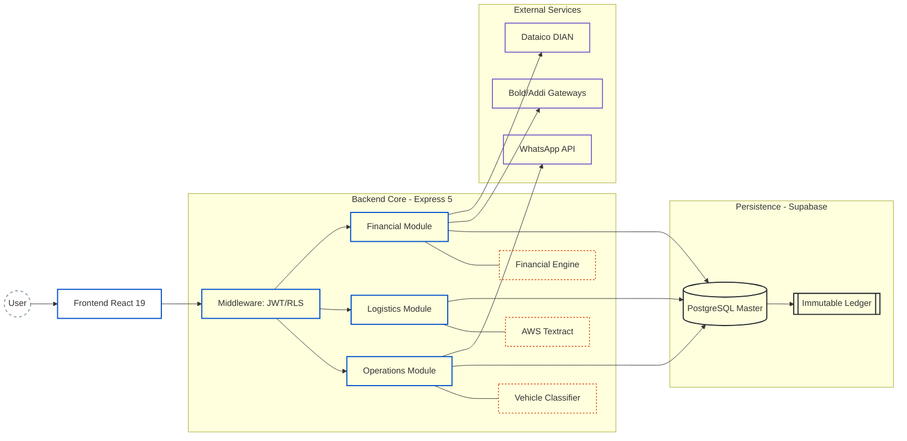
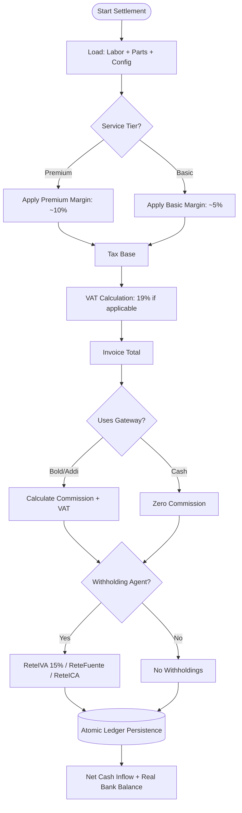

# Efisco ERP — Automotive Workshop SaaS

> **High-precision software engineering applied to profitability and automation in the automotive sector.**

Efisco is a SaaS platform designed to transform mechanical workshops into intelligent operational centers. Unlike a generic ERP, Efisco integrates a **Financial Engine (Fiscal/Accounting)** adapted to Colombian 2026 regulations, a **Vehicle Classifier** for dynamic pricing, and **AI-powered OCR** for expense control.


> 🌐 [Leer en Español](./README.es.md)

---

## Table of Contents

- [General Overview](#general-overview)
- [Architecture](#architecture)
- [Tech Stack](#tech-stack)
- [System Modules](#system-modules)
- [Financial Engine](#financial-engine)
- [Auxiliary Ledger (Cash Flow Ledger)](#auxiliary-ledger-cash-flow-ledger)
- [Environment Variables](#environment-variables)

---

## General Overview

Efisco is not a generic ERP adapted to the automotive sector — it was built from scratch to solve the real problems of Colombian workshops:

- **Dynamic pricing** based on a vehicle classifier by segment (basic / premium)
- **Precise tax settlement** under Colombian 2026 regulations: VAT, ReteFuente, ReteICA, ReteIVA, GMF 4×1000
- **Expense control with OCR** — automatic data extraction from supplier invoices via AWS Textract
- **Electronic invoicing** integrated with Dataico/DIAN (non-blocking, stores CUFE in the database)
- **Automated client communication** via WhatsApp Cloud API (Meta)
- **Multi-tenant** with data isolation per workshop (RLS in Supabase)
- **Credit sales** with installment plans: INC_GROSS is recorded at $0 upon settlement and real income enters via installment payments
- **Break-even panel** with disaggregated fixed costs (rent + utilities + payroll) and operational capacity analysis

---

## Architecture

The system uses a **multi-tenant** architecture with row-level data isolation (RLS) and an immutable financial calculation core.

### 1. Component and Layer Map



---

## Operational Lifecycle (End-to-End)

Complete execution flow with state management and synchronous activations.

```mermaid
sequenceDiagram
    autonumber
    participant C as Client
    participant R as Reception
    participant WA as WhatsApp (Meta)
    participant B as Bay (Ops)
    participant I as Inventory
    participant F as Finance
    participant EXT as Externals (DIAN/Pay)
    participant DB as Persistence (DB)

    C->>R: Intake (Fault Report)
    activate R
    R->>WA: Notify Client
    R->>B: Convert to Work Order
    activate B
    Note over B: Classifier assigns Tier (Basic/Premium)
    deactivate R

    loop During Service
        B->>I: Request Part
        activate I
        I->>DB: Validate Stock & TX
        DB-->>I: Confirmation
        I-->>B: Item Delivered
        deactivate I
        B->>B: Accumulate Costs
    end

    B->>F: Finalize and Settle
    activate F
    deactivate B

    rect rgb(0, 0, 0)
        Note over F, DB: Accounting Close Process (Fiscal 2026)
        F->>F: Run FinancialEngine
        F->>DB: Insert Ledger Entries
        F->>EXT: Issue Invoice & Process Payment
    end

    F->>C: Vehicle Ready + Digital Invoice
    deactivate F
```



---

## Inventory Logic and Immutable Kardex

Full traceability: every physical movement generates a mandatory accounting entry in the database.


---

## Financial Engine (FinancialEngine.js)

### Settlement Decision Matrix



---

## Tech Stack

| Layer | Technology | Role |
|:---|:---|:---|
| UI | React 19 + Vite | SPA with client-side routing |
| Styles | Tailwind CSS v4 | Utility-first design system |
| State | Zustand | Lightweight global state (`useFinancialStore`, `useBillingStore`, `useThemeStore`) |
| Backend | Express 5 + Node.js ESM | REST API with native async/await |
| Database | Supabase (PostgreSQL) | Persistence + multi-tenant RLS |
| OCR | AWS Textract | Supplier invoice extraction |
| Communications | Meta WhatsApp Cloud API | Automated notifications |
| Invoicing | Dataico | Electronic DIAN issuance (non-blocking) |
| Gateways | Bold (in-person/online/QR) + Addi (credit) | Payment processing |

---

## 🔑 Key Technical Decisions

- **Multi-tenant with RLS** — Row Level Security isolation in PostgreSQL guarantees total data separation between workshops without requiring independent databases.
- **Immutable Ledger** — Every financial movement is append-only. No record is ever updated or deleted, ensuring complete and auditable accounting traceability.
- **Asynchronous OCR pipeline** — Supplier invoice processing runs in the background via AWS Textract, keeping the interface responsive at all times.
- **Dynamic tier-based pricing** — The Vehicle Classifier automatically assigns the service tier, enabling margin control without manual per-service configuration.

---

## System Modules

### Frontend Routes

| Route | Module | Access |
|:---|:---|:---:|
| `/dashboard` | Dashboard | All |
| `/recepcion` | Reception | All |
| `/bahia` | Bays | All |
| `/inventario` | Inventory | All |
| `/proveedores` | Suppliers | All |
| `/ordenes` | Orders | All |
| `/referidos` | Referrals | All |
| `/soporte` | Support | All |
| `/config` | Configuration | Owner |
| `/finanzas` | Financial Dashboard | Owner |
| `/equilibrio` | Break-even Panel | Owner |
| `/cobros` | Collections Panel | Owner |
| `/flujo-caja` | Cash Flow | Owner |
| `/cliente/registro/:id` | Public Client Record | Public |

---

### Reception
Vehicle intake point. Records client, vehicle, and reported symptoms.

- **2-level client classification**: Natural Person | Company (with sub-regime: Simple / Ordinary / Large Taxpayer)
- The client type directly impacts withholding calculations at order settlement
- Automatic client notification via WhatsApp upon order creation
- Credit risk score visible before settlement (`/api/clients/:cedula/risk-score`)

---

### Bays (Work Orders)
Workshop job management: technician assignment, labor logging, and parts registration.

- Vehicle Classifier determines the service tier (Basic / Premium) which affects applied margins
- Inventory consumption with automatic Kardex entry; each item stores its `vat_percentage` (0%, 5%, or 19%)
- Order status: `pending → in_progress → ready_to_invoice → completed`
- **Settlement Modal** with live pre-calculation:
  - Bold/Addi commission simulation before confirming
  - Withholdings if the client is a withholding agent
  - Credit mode: installment selector (2/3/4), first payment date
- Upon settlement, an invoice is issued to Dataico/DIAN in a non-blocking manner; if successful, `cufe` and `invoice_pdf_url` are saved in `work_orders`

---

### Inventory
Stock management with complete traceability.

- **Immutable Kardex**: every movement (purchase, consumption, adjustment) generates a transaction in `inventory_transactions`
- Integration with the Suppliers module: registering a purchase automatically updates stock if `sync_stock = true`
- **Minimum stock alert per item** (`min_stock_vital`): the dashboard badge and table row color use each product's individual threshold. If `min_stock_vital` is not configured for an item, a fallback of 5 units applies
- `getItemHistory` sorts by `requested_at` (not by `created_at`)
- Items added to a work order store `vat_percentage` in `service_inventory_items`

---

### Suppliers and Expenses
Supplier management and purchase recording with fiscal expense settlement.

- **Supplier tax profile** (4 regimes): Natural Person · Simple Regime · Ordinary Regime · Large Taxpayer
  - `simple` regime: **no withholdings apply** (neither ReteFuente, ReteICA, nor ReteIVA)
  - `ordinary` / `large_taxpayer` regime: full withholdings per UVT (threshold: 27 UVT ≈ $1,358,586)
  - Supplier `is_declarante` flag determines the ReteFuente rate (declarant = `supplier_retefuente_rate`, non-declarant = rate × 1.4)
- **ReteICA rate per supplier** (`reteica_rate_supplier` in the `providers` table): if defined, it overrides the workshop's general rate
- **Invoice OCR**: upload image → AWS Textract extracts supplier, items, and values
- **Workshop payment method**:
  - `bank` — enables GMF 4×1000 option → generates `TAX_GMF` entry
  - `card` — field to record transaction cost → generates `CARD_FEE` entry
  - `cash` — no additional financial costs
- **PUC code per supplier** (`puc_account_expense`): if defined on the supplier, it is used in the ledger entry instead of the global code (`puc_inventory_purchase_code` or fallback `'1435'`)
- Payment voucher generated on screen with full breakdown

---

### Finance — Financial Dashboard (`/finanzas`)
Consolidated view of operational profitability.

- Net margin, gross income, fixed costs (rent + utilities + **payroll**)
- Stock alerts using `min_stock_vital` per item
- `calculateGlobalHealth` includes `GW_FEE`, `GW_VAT`, `TAX_GMF`, and `CARD_FEE` as real expenses (previously only `SUP_PAY`)

---

### Break-even Panel (`/equilibrio`)
Break-even analysis and workshop operational capacity.

```
Fixed Costs = rent + utilities + payroll (fixed_costs_salaries)
Contribution Margin = net income / gross income
Break-even Point = fixed costs / contribution margin
```

- If there is no income in the period, `contribution_margin` and `break_even_point` return `null` (no fictitious value is shown)
- Additional metrics: available/worked hours, hourly rate, potential income (`ip`)
- Requires the `workshop_config.fixed_costs_salaries` column (see migrations)

---

### Collections Panel (`/cobros`)
Accounts receivable management — credit sales and installments.

- List of pending installments with due dates
- Installment payment recording: calls `POST /api/billing/installment/:id/pay`
  - Generates `INC_GROSS` entry with `net_amount = inst.amount` and PUC `puc_income_code || '4135'`
  - Client notification via WhatsApp upon recording each payment

---

### Cash Flow (`/flujo-caja`)
General ledger of all financial movements in the workshop.

- Filter by date range (default: current month)
- Filter by impact type (`CREDIT` / `DEBIT` / All)
- Grouping by day with daily subtotals for credits and debits
- Running balance per movement (`running_balance`)
- Full labels for all ledger types (see table in [Auxiliary Ledger](#auxiliary-ledger-cash-flow-ledger) section)
- CSV download via `/api/finance/report/ledger`

---

### Referrals
Inter-workshop referral system with accumulated discounts for active referred subscriptions.

| Referred Subscriptions | Applied Discount |
|:---:|:---|
| 1 | 33% off monthly fee |
| 2 | 66% off monthly fee |
| 3+ | 100% (free month) |
| Platinum (>5) | 15% direct commission (applied by EFISCO) |

---

### Workshop Configuration (`/config`)
Fiscal and operational administration panel. Five tabs:

**1. Workshop Details**
- Name, address, neighborhood
- Hours (opening, closing, lunch, weekends, holidays)
- Fixed costs: rent and utilities

**2. My Team & Roles**
- Employee registration (mechanic / admin)
- Compensation schemes: fixed salary, variable commission, hybrid
- System access credential creation

**3. Service Catalog**
- Service CRUD with basic/premium margins per vehicle type

**4. Gateways and Finance**

*Tax Regime* (4 options):
| Option | VAT | Simple Reg. | Withholding Agent |
|:---|:---:|:---:|:---:|
| Not VAT Responsible | ✗ | ✗ | ✗ |
| Simple Regime (SIMPLE) | ✓ | ✓ | ✗ |
| Ordinary Regime | ✓ | ✗ | ✓ |
| Large Taxpayer | ✓ | ✗ | ✓ |

*Configurable withholding rates*:
- VAT (default 19%)
- ReteICA (per thousand, default 0.966‰)
- ReteFuente purchases – declarants (default 2.5%)
- ReteFuente purchases – non-declarants (default 3.5%)
- ReteIVA (default 15%)

*Gateways*:
- Bold in-person (default 2.99%)
- Bold online (default 3.49%)
- Addi (default 10.5%)
- GMF 4×1000 toggleable per payment

**5. Accountant Module**

*Legal Identity*: NIT, Business Name, Invoice Prefix, DIAN Technical Key

*Chart of Accounts (PUC) — 21 codes across 5 blocks*:

| Block | Codes | Defaults |
|:---|:---|:---|
| Income & Sales | `puc_income_code`, `puc_parts_income_code`, `puc_gateway_fee_code`, `puc_gateway_vat_code` | `4135`, `4135`, `5290`, `2408` |
| VAT | `puc_iva_generated_code`, `puc_iva_generated_5_code`, `puc_iva_deductible_code`, `puc_devolucion_iva_code` | `240805`, `240810`, `240820`, `135520` |
| Withholdings Payable | `puc_retefuente_code`, `puc_retefuente_compras_decl_code`, `puc_retefuente_compras_nodecl_code`, `puc_retefuente_servicios_code`, `puc_reteiva_code`, `puc_reteica_code` | `2365`, `236540`, `236540`, `236525`, `2367`, `2368` |
| Withholdings Receivable | `puc_anticipo_retefuente_code`, `puc_anticipo_reteica_code`, `puc_pasarela_retencion_code` | `135515`, `135518`, `135595` |
| Financial Control | `puc_cxc_clientes_code`, `puc_cxp_proveedores_code`, `puc_otros_ingresos_code`, `puc_gastos_financieros_code` | `130505`, `220505`, `4210`, `5305` |

*Accounting export*: CSV of invoices, supplier purchases, AR, AP, fiscal ledger, and valued inventory.

*Dataico integration*: API key configuration, authtoken, environment (test/prod), and numbering range with connection test button.

---

## Financial Engine

`backend/utils/financialEngine.js` — immutable calculation core. 2026 constants: UVT = $50,318, withholding threshold = 27 UVT ≈ $1,358,586.

### 1. Service Settlement (`liquidateClientInvoice`)

```
Tax Base     = Labor × (1 + margin%) + Parts (with margin)
VAT          = Base × vat_percentage            (if is_responsable_iva)
Invoice Total = Base + VAT

If the client is a withholding agent (clientIsRetainer):
  ReteFuente = Base × retefuente_rate_declarante   (from workshop config)
  ReteICA    = Base × (reteica_rate / 1000)        (per thousand, not percent)
  ReteIVA    = VAT  × reteiva_rate

Bold Gateway (in-person):
  domestic_card         → 2.99% + $300 fixed
  international_card    → 3.99% + $300 fixed
  qr_wallet             → 1.50% (no fixed fee)

Bold Gateway (online):
  domestic_card         → 3.49% + $900 fixed
  international_card    → 4.49% + $900 fixed
  qr_wallet             → 1.50%

Addi Gateway: gateway_addi_rate / 100

VAT on commission = Commission × 0.19

Net Cash Inflow = Total − ReteFuente − ReteICA − ReteIVA − Commission − Commission VAT
```

**Credit sale** (`payment_mode = 'credito'` and `num_installments > 1`):
- Upon settlement: `INC_GROSS.net_amount = 0`, PUC uses `puc_cxc_clientes_code || '1305'` (Accounts Receivable)
- Real income enters the ledger via `payInstallment` with `INC_GROSS.net_amount = installment.amount` and PUC `puc_income_code || '4135'`

---

### 2. Purchase Settlement (`liquidateSupplierPurchase`)

```
Base            = total_gross_cost / (1 + 0.19)
Purchase VAT    = total_gross_cost − Base

Withholdings (only if base ≥ 27 UVT AND supplier regime ≠ 'simple'):
  ReteFuente:
    is_declarante = true  → Base × supplier_retefuente_rate       (config)
    is_declarante = false → Base × supplier_retefuente_rate × 1.4 (approx. non-declarant rate)
  ReteICA:
    if supplier.reteica_rate_supplier is defined:
      Base × (supplier.reteica_rate_supplier / 1000)
    otherwise:
      Base × (config.supplier_reteica_rate / 1000 || 0.00966)
  ReteIVA = VAT × 0.15

GMF 4×1000 (only if payment_method='bank' and apply_4x1000=true):
  GMF = total_gross_cost × 0.004

Net Outflow = total_gross_cost − ReteFuente − ReteICA − GMF
```

**Supplier Simple Regime**: completely omits ReteFuente, ReteICA, and ReteIVA.

---

### 3. Global Financial Health (`calculateGlobalHealth`)

```
totalInflows  = Σ net_amount of INC_GROSS (CREDIT)
              + Σ amount of NON_OP_INC (CREDIT)
              + Σ amount of VAT_REFUND (CREDIT)

totalOutflows = Σ net_amount of SUP_PAY + GW_FEE + GW_VAT + TAX_GMF + CARD_FEE (DEBIT)

bankBalance     = totalInflows − totalOutflows
ivaLiability    = Σ TAX_IVA (CREDIT) − Σ RET_IVA (DEBIT) − Σ VAT_REFUND
realBankBalance = bankBalance − ivaLiability
```

---

## Auxiliary Ledger (Cash Flow Ledger)

`cash_flow_ledger` — double-entry record of all workshop movements.

### Main Fields

| Field | Description |
|:---|:---|
| `type` | Movement type (see table below) |
| `impact` | `CREDIT` (inflow) or `DEBIT` (outflow) |
| `amount` | Gross value of the movement (invoice total) |
| `gross_amount` | Base before VAT |
| `net_amount` | Amount effectively received or paid |
| `puc_code` | PUC code for accounting export |
| `running_balance` | Accumulated balance for the period |

### Movement Types

| Type | Impact | Description |
|:---|:---:|:---|
| `INC_GROSS` | CREDIT | Service income (net_amount = 0 on credit sales) |
| `TAX_IVA` | CREDIT | VAT generated on the sale |
| `RET_FUENT` | DEBIT | ReteFuente withheld by the client |
| `RET_ICA` | DEBIT | ReteICA withheld by the client |
| `RET_IVA` | DEBIT | ReteIVA withheld by the client |
| `GW_FEE` | DEBIT | Gateway commission (Bold / Addi) |
| `GW_VAT` | DEBIT | VAT on gateway commission |
| `SUP_PAY` | DEBIT | Supplier payment (parts purchase) |
| `TAX_GMF` | DEBIT | GMF 4×1000 on bank payments |
| `CARD_FEE` | DEBIT | Card transaction cost |
| `NON_OP_INC` | CREDIT | Non-operational income (manual) |
| `VAT_REFUND` | CREDIT | VAT refund (`puc_code = '135520'`) |
| `MAN_INC` | CREDIT | Manual income recorded by the user |
| `MAN_EGR` | DEBIT | Manual expense recorded by the user |
| `REFERRAL` | CREDIT | Referral commission income |

---

## Environment Variables

`backend/.env.example`:

```env
# Supabase
SUPABASE_URL=https://<project>.supabase.co
SUPABASE_SERVICE_ROLE_KEY=<service-role-key>

# JWT
JWT_SECRET=<random-secure-secret>

# AWS Textract (OCR)
AWS_ACCESS_KEY_ID=<key>
AWS_SECRET_ACCESS_KEY=<secret>
AWS_REGION=us-east-1

# WhatsApp Meta Cloud API
WHATSAPP_TOKEN=<bearer-token>
WHATSAPP_PHONE_NUMBER_ID=<phone-id>

# Dataico (DIAN Invoicing)
DATAICO_AUTH_TOKEN=<auth-token>
DATAICO_BASE_URL=https://app.dataico.com/api/2
```

---

## 📬 Contact
efiscosas@gmail.com

Developed and maintained by a single developer. Open to feedback, contributions, and collaboration.

---

**Efisco ERP** — *Driving automotive engineering through high-performance software.*
