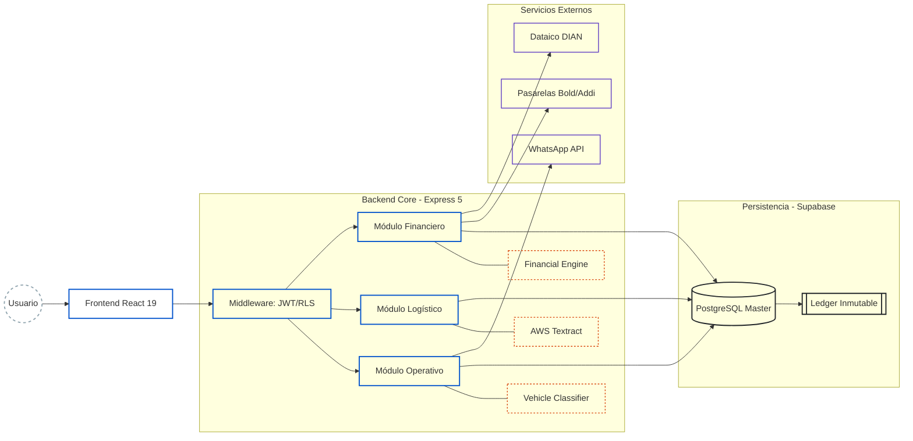
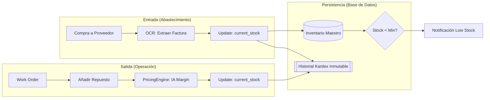
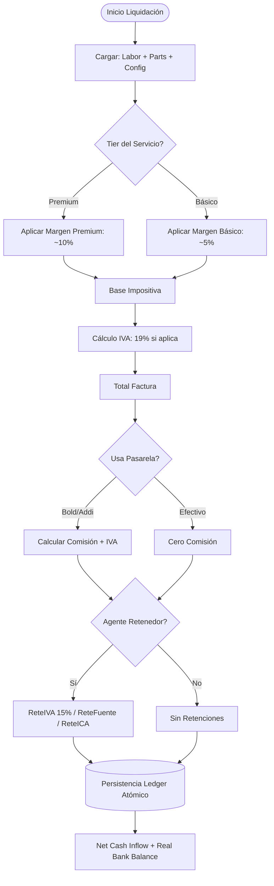

# Efisco ERP 🔧 - Automotive Management & Automation SaaS

> **Ingeniería de software de alta precisión aplicada a la rentabilidad y automatización del sector automotriz.**

Efisco es una plataforma SaaS diseñada para transformar talleres mecánicos en centros operativos inteligentes. A diferencia de un ERP genérico, Efisco integra un **Motor Financiero (Fiscal/Contable)** adaptado a la normativa colombiana de 2026, un **Clasificador de Vehículos** para tarificación dinámica y **OCR con IA** para el control de egresos.


---

## 🏗️ Arquitectura de Sistema y Blindaje Técnico

El sistema utiliza una arquitectura multi-tenant con aislamiento de datos a nivel de fila (RLS) y un núcleo de cálculo financiero inmutable.

### 1. Mapa de Componentes y Capas



---

## 🔄 Ciclo de Vida Operativo (End-to-End)

Flujo de ejecución con gestión de estados y activaciones síncronas. La proximidad de servicios externos evita cruces visuales.

```mermaid
sequenceDiagram
    autonumber
    participant C as Cliente
    participant R as Recepción
    participant WA as WhatsApp (Meta)
    participant B as Bahía (Ops)
    participant I as Inventario
    participant F as Finanzas
    participant EXT as Externos (DIAN/Pay)
    participant DB as Persistencia (DB)

    C->>R: Ingreso (Reporte de Fallo)
    activate R
    R->>WA: Notificar al Cliente
    R->>B: Convertir a Orden de Trabajo
    activate B
    Note over B: El Classifier asigna Tier (Básico/Premium)
    deactivate R
    
    loop Durante el Servicio
        B->>I: Solicitar Repuesto
        activate I
        I->>DB: Validar Stock & TX
        DB-->>I: Confirmación
        I-->>B: Item Entregado
        deactivate I
        B->>B: Acumular Costos
    end
    
    B->>F: Finalizar y Liquidar
    activate F
    deactivate B
    
    rect rgb(0, 0, 0)
        Note over F, DB: Proceso de Cierre Contable (Fiscal 2026)
        F->>F: Calcular FinancialEngine
        F->>DB: Insertar Movimientos Ledger
        F->>EXT: Emitir Factura & Procesar Pago
    end
    
    F->>C: Vehículo Listo + Factura Digital
    deactivate F
```



---

## 📦 Lógica de Inventario y Kardex Inmutable

Trazabilidad total: cada movimiento físico genera un reflejo contable obligatorio en la base de datos.



---

## 📊 Motor Financiero (FinancialEngine.js)

### 1. Matriz de Decisión de Liquidación



---

## 🛠️ Stack Tecnológico de Alto Rendimiento

| Capa | Tecnología | Propósito |
| :--- | :--- | :--- |
| **UI Framework** | React 19 (Beta) | Reactividad ultra-rápida y concurrencia. |
| **Styles** | Tailwind CSS v4 | Diseño atómico y optimización de bundle. |
| **State** | Zustand | Gestión de estado ligero y escalable. |
| **Backend** | Express 5 + Node.js | API robusta con soporte nativo para promesas. |
| **Database** | Supabase (PostgreSQL) | Persistencia, RLS y Webhooks en tiempo real. |
| **AI/OCR** | AWS Textract | Extracción de datos de facturas de proveedores. |
| **Comms** | Meta WhatsApp Cloud API | Comunicación automatizada con el cliente. |

---

## 🚀 Ejecución y Pruebas

```bash
# Servidor Backend (0.0.0.0:3000)
cd backend && pnpm dev

# Cliente Frontend (Vite)
cd frontend && pnpm dev

# Suite de Pruebas Unitarias (Lógica Financiera y Clasificación)
cd backend && pnpm test
```

---

**Efisco ERP** — *Impulsando la ingeniería automotriz a través de software de alto rendimiento.*
