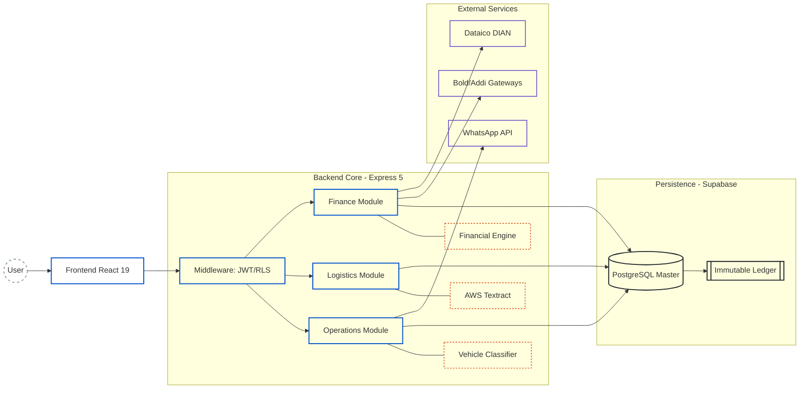
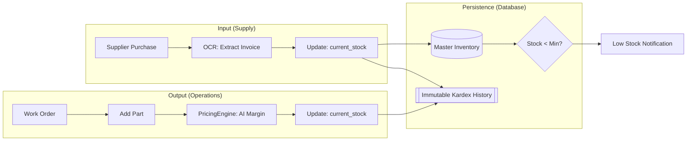
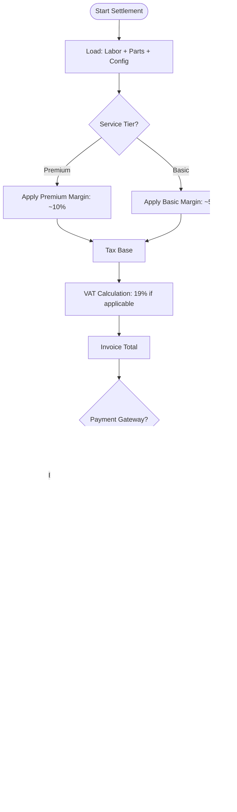

# Efisco ERP 🔧 - Automotive Management & Automation SaaS

> **High-precision software engineering applied to profitability and automation in the automotive sector.**

Efisco is a SaaS platform designed to transform mechanical workshops into intelligent operational centers. Unlike a generic ERP, Efisco integrates a **Financial Engine (Fiscal/Accounting)** adapted to Colombian regulations (2026), a **Vehicle Classifier** for dynamic pricing, and **AI-powered OCR** for expense control.


> 🌐 [Leer en Español](./README.es.md)

---

## 🏗️ System Architecture & Technical Design

The system uses a **multi-tenant architecture** with row-level data isolation (RLS) and an immutable financial calculation core.

### 1. Component & Layer Map



---

## 🔄 Operational Lifecycle (End-to-End)

Full execution flow with state management and synchronous activations.


---

## 📦 Inventory Logic & Immutable Kardex

Full traceability: every physical movement generates a mandatory accounting entry in the database.



---

## 📊 Financial Engine (FinancialEngine.js)

### Settlement Decision Matrix



---

## 🛠️ High-Performance Tech Stack

| Layer | Technology | Purpose |
| :--- | :--- | :--- |
| **UI Framework** | React 19 (Beta) | Ultra-fast reactivity and concurrency |
| **Styles** | Tailwind CSS v4 | Atomic design and bundle optimization |
| **State** | Zustand | Lightweight and scalable state management |
| **Backend** | Express 5 + Node.js | Robust API with native promise support |
| **Database** | Supabase (PostgreSQL) | Persistence, RLS and real-time Webhooks |
| **AI/OCR** | AWS Textract | Data extraction from supplier invoices |
| **Comms** | Meta WhatsApp Cloud API | Automated client communication |

---

## 🔑 Key Technical Decisions

- **Multi-tenant with RLS** — Row-level security in PostgreSQL ensures complete data isolation between workshops without separate databases.
- **Immutable Ledger** — Every financial movement is append-only. No record is ever updated or deleted, guaranteeing full accounting auditability.
- **Async OCR pipeline** — Supplier invoice processing runs in the background via AWS Textract, keeping the UI responsive.
- **Dynamic tier pricing** — The Vehicle Classifier automatically assigns service tiers, enabling margin control without manual configuration per service.

---

## 🚀 Getting Started

```bash
# Backend server (0.0.0.0:3000)
cd backend && pnpm dev

# Frontend client (Vite)
cd frontend && pnpm dev

# Unit test suite (Financial logic & Classification)
cd backend && pnpm test
```

---

## 📬 Contact
efiscosas@gmail.com

Built and maintained by a single developer. Open to feedback, contributions and collaboration.
---

**Efisco ERP** — *Driving automotive engineering through high-performance software.*
